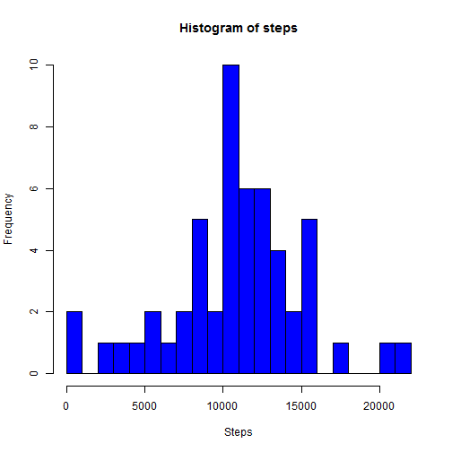
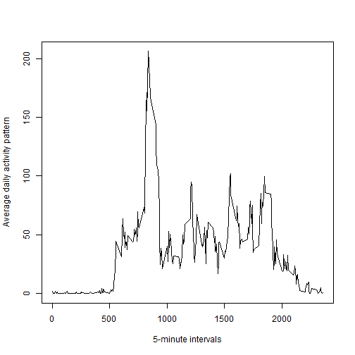
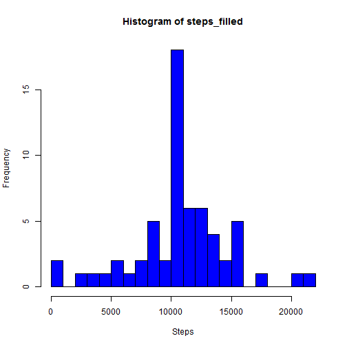
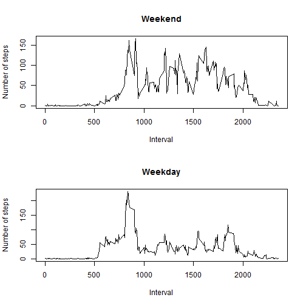

PEER ASSESSMENT 1
========================================================

This is an R Markdown document that contains the solution for the Peer Assessment 1 of the course Reproducible Research.

## Setting global options

First of all, global options are set, in such a way that the code is always generated in the output document.


```r
opts_chunk$set(echo=TRUE)
```

## Loading and preprocessing the data

### 1. Load the data

The file is downloaded from the web and unzipped:


```r
download.file(url="http://d396qusza40orc.cloudfront.net/repdata%2Fdata%2Factivity.zip",destfile="data.zip")
unzip(zipfile="repdata-data-activity.zip")
```

Then, the data is loaded:


```r
data <- read.csv("activity.csv",sep=",")
head(data)
```

```
##   steps       date interval
## 1    NA 2012-10-01        0
## 2    NA 2012-10-01        5
## 3    NA 2012-10-01       10
## 4    NA 2012-10-01       15
## 5    NA 2012-10-01       20
## 6    NA 2012-10-01       25
```

### 2. Process/transform the data (if necessary) into a format suitable for your analysis

The column *date* of the data frame is converted to Date class:


```r
data$date <- as.Date(as.character(data$date))
```

## What is mean total number of steps taken per day?

### 1. Make a histogram of the total number of steps taken each day

First of all, NA values are found:


```r
tf <- is.na(data$steps)
```

Then, a new data frame is created without the found NA values:


```r
new_data <- data[!tf,]
head(new_data)
```

```
##     steps       date interval
## 289     0 2012-10-02        0
## 290     0 2012-10-02        5
## 291     0 2012-10-02       10
## 292     0 2012-10-02       15
## 293     0 2012-10-02       20
## 294     0 2012-10-02       25
```

After that, a vector containing all the dates for which data is obtained is defined:


```r
duplicate <- duplicated(new_data$date)
days <- new_data$date[!duplicate]
days
```

```
##  [1] "2012-10-02" "2012-10-03" "2012-10-04" "2012-10-05" "2012-10-06"
##  [6] "2012-10-07" "2012-10-09" "2012-10-10" "2012-10-11" "2012-10-12"
## [11] "2012-10-13" "2012-10-14" "2012-10-15" "2012-10-16" "2012-10-17"
## [16] "2012-10-18" "2012-10-19" "2012-10-20" "2012-10-21" "2012-10-22"
## [21] "2012-10-23" "2012-10-24" "2012-10-25" "2012-10-26" "2012-10-27"
## [26] "2012-10-28" "2012-10-29" "2012-10-30" "2012-10-31" "2012-11-02"
## [31] "2012-11-03" "2012-11-05" "2012-11-06" "2012-11-07" "2012-11-08"
## [36] "2012-11-11" "2012-11-12" "2012-11-13" "2012-11-15" "2012-11-16"
## [41] "2012-11-17" "2012-11-18" "2012-11-19" "2012-11-20" "2012-11-21"
## [46] "2012-11-22" "2012-11-23" "2012-11-24" "2012-11-25" "2012-11-26"
## [51] "2012-11-27" "2012-11-28" "2012-11-29"
```

Then, the number of steps taken per each of the days above is calculated:


```r
steps <- vector("numeric",length(days))
for (i in 1:length(days)) {
    for (j in 1:nrow(new_data)) {
        if (new_data$date[j]==days[i]) {
            steps[i] <- steps[i] + new_data$steps[j]
        }
    }
}
steps
```

```
##  [1]   126 11352 12116 13294 15420 11015 12811  9900 10304 17382 12426
## [12] 15098 10139 15084 13452 10056 11829 10395  8821 13460  8918  8355
## [23]  2492  6778 10119 11458  5018  9819 15414 10600 10571 10439  8334
## [34] 12883  3219 12608 10765  7336    41  5441 14339 15110  8841  4472
## [45] 12787 20427 21194 14478 11834 11162 13646 10183  7047
```

Finally, a histogram of the total number of steps taken each day is made:


```r
hist(steps,breaks=16,col="blue",xlab="Steps")
```

 

### 2. Calculate and report the mean and median total number of steps taken per day

The mean total number of steps taken per day is calculated:


```r
mean_steps <- mean(steps)
mean_steps
```

```
## [1] 10766
```

The median total number of steps taken per day is calculated:


```r
median_steps <- median(steps)
median_steps
```

```
## [1] 10765
```

The mean is equal to 1.0766 &times; 10<sup>4</sup> and the median is equal to 1.0765 &times; 10<sup>4</sup> .

## What is the average daily activity pattern?

### 1. Make a time series plot (i.e. type = "l") of the 5-minute interval (x-axis) and the average number of steps taken, averaged across all days (y-axis)

A vector called *int* is created containing all the intervals in a day:


```r
count <- 0
int <- vector("integer",length=12*24)
for (i in 0:23) {
    for (j in seq(0,55,by=5)) {
        count <- count + 1
        if (i==0) {
            int[count] <- as.integer(paste(i,j,sep=""))            
        }
        else if (j==0 | j==5) {
            int[count] <- as.integer(paste(i,0,j,sep=""))
        }
        else {
            int[count] <- as.integer(paste(i,j,sep=""))
        }
    }
}
int
```

```
##   [1]    0    5   10   15   20   25   30   35   40   45   50   55  100  105
##  [15]  110  115  120  125  130  135  140  145  150  155  200  205  210  215
##  [29]  220  225  230  235  240  245  250  255  300  305  310  315  320  325
##  [43]  330  335  340  345  350  355  400  405  410  415  420  425  430  435
##  [57]  440  445  450  455  500  505  510  515  520  525  530  535  540  545
##  [71]  550  555  600  605  610  615  620  625  630  635  640  645  650  655
##  [85]  700  705  710  715  720  725  730  735  740  745  750  755  800  805
##  [99]  810  815  820  825  830  835  840  845  850  855  900  905  910  915
## [113]  920  925  930  935  940  945  950  955 1000 1005 1010 1015 1020 1025
## [127] 1030 1035 1040 1045 1050 1055 1100 1105 1110 1115 1120 1125 1130 1135
## [141] 1140 1145 1150 1155 1200 1205 1210 1215 1220 1225 1230 1235 1240 1245
## [155] 1250 1255 1300 1305 1310 1315 1320 1325 1330 1335 1340 1345 1350 1355
## [169] 1400 1405 1410 1415 1420 1425 1430 1435 1440 1445 1450 1455 1500 1505
## [183] 1510 1515 1520 1525 1530 1535 1540 1545 1550 1555 1600 1605 1610 1615
## [197] 1620 1625 1630 1635 1640 1645 1650 1655 1700 1705 1710 1715 1720 1725
## [211] 1730 1735 1740 1745 1750 1755 1800 1805 1810 1815 1820 1825 1830 1835
## [225] 1840 1845 1850 1855 1900 1905 1910 1915 1920 1925 1930 1935 1940 1945
## [239] 1950 1955 2000 2005 2010 2015 2020 2025 2030 2035 2040 2045 2050 2055
## [253] 2100 2105 2110 2115 2120 2125 2130 2135 2140 2145 2150 2155 2200 2205
## [267] 2210 2215 2220 2225 2230 2235 2240 2245 2250 2255 2300 2305 2310 2315
## [281] 2320 2325 2330 2335 2340 2345 2350 2355
```

The average daily activity pattern is calculated:


```r
average_pattern <- vector("numeric",length=length(int))
for (i in 1:length(int)) {
    tf <- new_data$interval==int[i]
    sub <- new_data[tf,]
    average_pattern[i] = mean(sub$steps)
}
average_pattern
```

```
##   [1]   1.71698   0.33962   0.13208   0.15094   0.07547   2.09434   0.52830
##   [8]   0.86792   0.00000   1.47170   0.30189   0.13208   0.32075   0.67925
##  [15]   0.15094   0.33962   0.00000   1.11321   1.83019   0.16981   0.16981
##  [22]   0.37736   0.26415   0.00000   0.00000   0.00000   1.13208   0.00000
##  [29]   0.00000   0.13208   0.00000   0.22642   0.00000   0.00000   1.54717
##  [36]   0.94340   0.00000   0.00000   0.00000   0.00000   0.20755   0.62264
##  [43]   1.62264   0.58491   0.49057   0.07547   0.00000   0.00000   1.18868
##  [50]   0.94340   2.56604   0.00000   0.33962   0.35849   4.11321   0.66038
##  [57]   3.49057   0.83019   3.11321   1.11321   0.00000   1.56604   3.00000
##  [64]   2.24528   3.32075   2.96226   2.09434   6.05660  16.01887  18.33962
##  [71]  39.45283  44.49057  31.49057  49.26415  53.77358  63.45283  49.96226
##  [78]  47.07547  52.15094  39.33962  44.01887  44.16981  37.35849  49.03774
##  [85]  43.81132  44.37736  50.50943  54.50943  49.92453  50.98113  55.67925
##  [92]  44.32075  52.26415  69.54717  57.84906  56.15094  73.37736  68.20755
##  [99] 129.43396 157.52830 171.15094 155.39623 177.30189 206.16981 195.92453
## [106] 179.56604 183.39623 167.01887 143.45283 124.03774 109.11321 108.11321
## [113] 103.71698  95.96226  66.20755  45.22642  24.79245  38.75472  34.98113
## [120]  21.05660  40.56604  26.98113  42.41509  52.66038  38.92453  50.79245
## [127]  44.28302  37.41509  34.69811  28.33962  25.09434  31.94340  31.35849
## [134]  29.67925  21.32075  25.54717  28.37736  26.47170  33.43396  49.98113
## [141]  42.03774  44.60377  46.03774  59.18868  63.86792  87.69811  94.84906
## [148]  92.77358  63.39623  50.16981  54.47170  32.41509  26.52830  37.73585
## [155]  45.05660  67.28302  42.33962  39.88679  43.26415  40.98113  46.24528
## [162]  56.43396  42.75472  25.13208  39.96226  53.54717  47.32075  60.81132
## [169]  55.75472  51.96226  43.58491  48.69811  35.47170  37.54717  41.84906
## [176]  27.50943  17.11321  26.07547  43.62264  43.77358  30.01887  36.07547
## [183]  35.49057  38.84906  45.96226  47.75472  48.13208  65.32075  82.90566
## [190]  98.66038 102.11321  83.96226  62.13208  64.13208  74.54717  63.16981
## [197]  56.90566  59.77358  43.86792  38.56604  44.66038  45.45283  46.20755
## [204]  43.67925  46.62264  56.30189  50.71698  61.22642  72.71698  78.94340
## [211]  68.94340  59.66038  75.09434  56.50943  34.77358  37.45283  40.67925
## [218]  58.01887  74.69811  85.32075  59.26415  67.77358  77.69811  74.24528
## [225]  85.33962  99.45283  86.58491  85.60377  84.86792  77.83019  58.03774
## [232]  53.35849  36.32075  20.71698  27.39623  40.01887  30.20755  25.54717
## [239]  45.66038  33.52830  19.62264  19.01887  19.33962  33.33962  26.81132
## [246]  21.16981  27.30189  21.33962  19.54717  21.32075  32.30189  20.15094
## [253]  15.94340  17.22642  23.45283  19.24528  12.45283   8.01887  14.66038
## [260]  16.30189   8.67925   7.79245   8.13208   2.62264   1.45283   3.67925
## [267]   4.81132   8.50943   7.07547   8.69811   9.75472   2.20755   0.32075
## [274]   0.11321   1.60377   4.60377   3.30189   2.84906   0.00000   0.83019
## [281]   0.96226   1.58491   2.60377   4.69811   3.30189   0.64151   0.22642
## [288]   1.07547
```

The average daily activity pattern is plotted:


```r
plot(int,average_pattern,type="l",xlab="5-minute intervals",ylab="Average daily activity pattern")
```

 

### 2. Which 5-minute interval, on average across all the days in the dataset, contains the maximum number of steps?

The 5-minute interval that contains the maximum number of steps is obtained:


```r
library(nnet)
max_step_interval = int[which.is.max(average_pattern)]
max_step_interval
```

```
## [1] 835
```

The interval that contains the maximum number of steps is 835 .

## Imputing missing values

### 1. Calculate and report the total number of missing values in the dataset (i.e. the total number of rows with NAs)

The number of rows with NAs is calculated:


```r
NArows <- nrow(data)-nrow(new_data)
NArows
```

```
## [1] 2304
```

The number of missing values is equal to 2304 .

### 2. Devise a strategy for filling in all of the missing values in the dataset. The strategy does not need to be sophisticated. For example, you could use the mean/median for that day, or the mean for that 5-minute interval, etc.

The strategy selected for filling NA values is the following: use the mean for each 5-minute interval

### 3. Create a new dataset that is equal to the original dataset but with the missing data filled in

First of all a data frame called *filled_data* is created as a copy of the original dataset:


```r
filled_data <- data
```

Then, each row containing a NA value in the step column is substituted by the corresponding value for each interval:


```r
for (i in 1:nrow(data)) {
    if (is.na(filled_data$steps[i])) {
        filled_data$steps[i] <- average_pattern[which(int==filled_data$interval[i])]
    }
}
```

### 4. Make a histogram of the total number of steps taken each day and Calculate and report the mean and median total number of steps taken per day. Do these values differ from the estimates from the first part of the assignment? What is the impact of imputing missing data on the estimates of the total daily number of steps?

A vector containing all the dates for which data is obtained is defined:


```r
duplicate_filled <- duplicated(filled_data$date)
```

Then, the number of steps taken per each of the days above is calculated:


```r
days_filled <- filled_data$date[!duplicate_filled]
# Calculate the number of steps per day
steps_filled <- vector("numeric",length(days_filled))
for (i in 1:length(days_filled)) {
    for (j in 1:nrow(filled_data)) {
        if (filled_data$date[j]==days_filled[i]) {
            steps_filled[i] <- steps_filled[i] + filled_data$steps[j]
        }
    }
}
```

After that, the histogram is made:


```r
hist(steps_filled,breaks=16,col="blue",xlab="Steps")
```

 

The mean and the median total number of steps taken per day is calculated:


```r
mean_steps_filled <- mean(steps_filled)
median_steps_filled <- median(steps_filled)
mean_steps_filled
```

```
## [1] 10766
```

```r
median_steps_filled
```

```
## [1] 10766
```

The mean value does not vary (1.0766 &times; 10<sup>4</sup>), whereas the median varies a little (from 1.0765 &times; 10<sup>4</sup> to 1.0766 &times; 10<sup>4</sup>). Consequently, using the aforementioned strategy causes a variation of the median, whereas the mean is kept constant.

## Are there differences in activity patterns between weekdays and weekends?

### 1. Create a new factor variable in the dataset with two levels - "weekday" and "weekend" indicating whether a given date is a weekday or weekend day.

Find those dates corresponding to weekend:


```r
Sys.setlocale("LC_TIME", "C")
```

```
## [1] "C"
```

```r
tf_weekend <- weekdays(filled_data$date) %in% c("Saturday","Sunday")
```

Define a vector called *week* with the information regarding weekend or weekday:


```r
week <- vector("character",length(nrow(filled_data)))
week[tf_weekend] <- "weekend"
week[!tf_weekend] <- "weekday"
```

Create a new factor variable in the dataset with the previous *week* variable:


```r
filled_data$week <- as.factor(week)
```

### 2. Make a panel plot containing a time series plot (i.e. type = "l") of the 5-minute interval (x-axis) and the average number of steps taken, averaged across all weekday days or weekend days (y-axis).

Calculate average daily activity pattern for weekday days and weekend days:


```r
average_pattern_weekend <- 0
average_pattern_weekday <- 0
for (i in 1:length(int)) {
    tf_weekend <- filled_data$interval==int[i] & filled_data$week=="weekend"
    tf_weekday <- filled_data$interval==int[i] & filled_data$week=="weekday"
    sub_weekend <- filled_data[tf_weekend,]
    sub_weekday <- filled_data[tf_weekday,]
    average_pattern_weekend[i] = mean(sub_weekend$steps)
    average_pattern_weekday[i] = mean(sub_weekday$steps)
}
```

The plot for the average daily activity pattern is made:


```r
par(mfrow=c(2,1))
plot(int,average_pattern_weekend,type="l",xlab="Interval",ylab="Number of steps",main="Weekend")
plot(int,average_pattern_weekday,type="l",xlab="Interval",ylab="Number of steps",main="Weekday")
```

 
